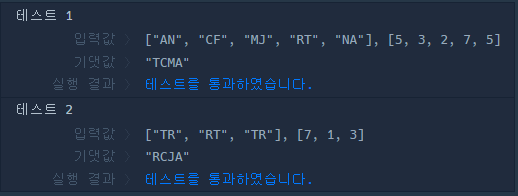
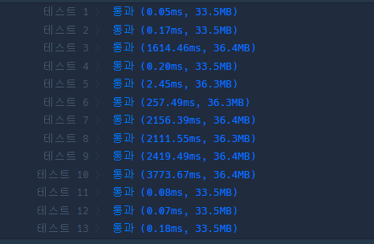
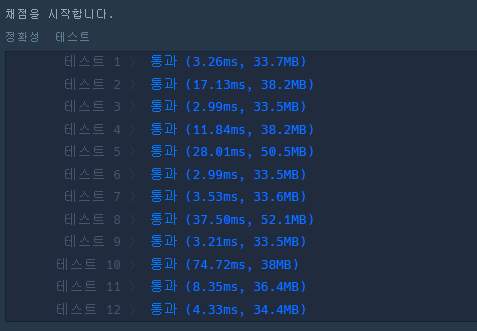

### kakao 성격유형검사하기

```javascript
function solution(survey, choices) {
    let json = {
        'R' : 0,
        'T' : 0,

        'C' : 0,
        'F' : 0,

        'J' : 0,
        'M' : 0,

        'A' : 0,
        'N' : 0,
    };
    
    survey.forEach((v,i) => {
        
        switch(choices[i]) {
            case 1: 
                json[v[0]]+=3;
                break;
            case 2: 
                json[v[0]]+=2;
                break;
            case 3: 
                json[v[0]]+=1;
                break;
            case 4: break;
            case 5: 
                json[v[1]]+=1;
                break;
            case 6: 
                json[v[1]]+=2;
                break;
            case 7: 
                json[v[1]]+=3;
                break;
        }
           
    })
    
    let result='';
    
    const arr = [['R','T'], ['C','F'], ['J','M'], ['A','N']];
    
    arr.forEach((v,i) => {
        json[v[0]] >= json[v[1]]? result+=v[0] :result+=v[1];
    })
    
    return result;
    
}

```



### 완전탐색>카펫

```javascript
function solution(brown, yellow) {
    
    let result = [];
    
    //i는 노란격자 세로길이, j는 노란격자 가로길이
    for(let i=1; i<=yellow; i++) {
        for(let j=1; j<=yellow; j++){
            //노란격자 세로 *가로길이는 노란격자 개수
            if(i*j==yellow) {
                //전체 격자 개수
                let allCnt = (i+2)*(j+2);
                //전체 격자 개수 - 노란격자 개수= 갈색격자 개수
                if(allCnt-yellow == brown) {
                    result.push(j+2, i+2)
                    return result;
                }
            }
        }
    }
    

```



### 완전탐색 > 소수찾기

```javascript

function solution(numbers) {
    //숫자로 나누어 배열로 만들기
    let arr = [...numbers].map((v,i) => Number(v));
    
    //순열 조합 함수
    const getPermutations = function (arr, selectNumber) {
        const results = [];
        if (selectNumber === 1) return arr.map((value) => [value]); // 1개씩 택할 때, 바로 모든 배열의 원소 return

        arr.forEach((fixed, index, origin) => {
          const rest = [...origin.slice(0, index), ...origin.slice(index + 1)]; // 해당하는 fixed를 제외한 나머지 배열
          const permutations = getPermutations(rest, selectNumber - 1); // 나머지에 대해 순열을 구한다.
          const attached = permutations.map((permutation) => [fixed, ...permutation]); // 돌아온 순열에 대해 떼 놓은(fixed) 값 붙이기
          results.push(...attached); // 배열 spread syntax 로 모두다 push
        });

        return results; // 결과 담긴 results return
    };
  
  let allPermu = [];
    
  //numbers 들어온 자릿수 만큼 조합
  for(let i=1; i<=arr.length; i++) {
      //조합했을 때 맨 앞자리 숫자가 0이 되면 0을 빼기위해 Number함수 사용
    result = getPermutations(arr, i).map((v)=> Number(v.join('')));
     //배열 안의 원소 분리해서 빈 배열에 옮기기
    allPermu.push(...result)
  }
    
  allPermu = Array.from(new Set(allPermu));
  
    //소수 판별해서 리턴
  const answer = allPermu.filter((v)=> {
    let num = 3;
    if(v==2) return true;
    else if(v<=1 || v % 2 == 0 || Math.sqrt(v) % 1 == 0 ) return false;
	while(v > num) {
        if (v % num === 0) return false;
        num+=2;
    }
    return true 
  })
  
  console.log(answer);
  return answer.length;
    
    
}
```



